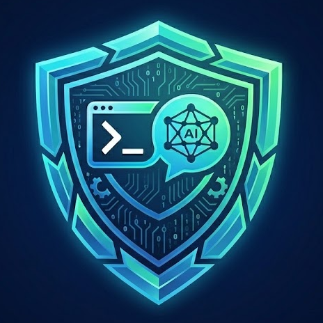

<div align="center">



# Ops Agent

[English](README.md)|**中文** 

面向运维场景的 AI 助手控制台

[快速开始](#快速开始) · [功能](#功能) · [配置](#配置) · [开发](#开发) · [桌面端](#桌面端)


</div>

## 项目定位

运维任务经常散落在资产台账、终端、模型对话、审批记录和执行输出之间。Ops Agent 把这些步骤放进一个统一工作台：AI 负责理解目标、生成计划、解释输出和推进排障，用户保留关键命令的最终审批权。

```text
配置模型 -> 选择资产 -> 打开终端 -> 发起对话 -> 审核计划 -> 审批命令 -> 执行 -> 回传结果
```

## 功能

- 资产管理：维护本地终端、Linux 主机、串口设备和网络设备资产。
- 终端工作台：支持本地 PTY、SSH、串口和网络设备 CLI。
- AI 运维助手：结合资产、终端输出和会话上下文进行规划与排障。
- 命令审批：命令执行前进入人工审批流程，审批结果、命令和输出可追踪。
- 多模型配置：支持 Anthropic、OpenAI Compatible、OpenAI Responses、Google Gemini、Azure OpenAI 及常见兼容供应商。
- MCP 与技能包：配置 MCP Server，加载技能包扩展助手能力。
- Web 与桌面端：支持浏览器运行，也可通过 Tauri 打包桌面应用。

## 安全边界

- 默认思路：AI 给建议，用户做审批。
- 命令执行结果、审批状态和会话事件会被记录，便于回溯。
- 敏感凭据不应写入日志；生产环境必须设置 `OPS_AGENT_SECRET_KEY`。
- 高风险变更类命令不应自动执行。

## 技术栈

| 层级 | 技术 |
| --- | --- |
| 后端 | Python 3.13+、FastAPI、SQLModel、SQLite、Uvicorn |
| AI / 工具 | Anthropic SDK、OpenAI SDK、Google GenAI、MCP、LangGraph、Netmiko、Paramiko |
| 前端 | React 18、TypeScript、Vite、Tailwind CSS、xterm.js |
| 桌面端 | Tauri 2、Rust |
| 包管理 | pip、pnpm |

## 快速开始

### 环境要求

- Python 3.13+
- Node.js 22+
- pnpm 10+
- Rust toolchain，仅桌面端开发或打包需要

### 安装依赖

Windows PowerShell：

```powershell
python -m venv .venv
.\.venv\Scripts\Activate.ps1
pip install -r requirements.txt
cd web
pnpm install
cd ..
```

macOS / Linux / Git Bash：

```bash
python3 -m venv .venv
source .venv/bin/activate
pip install -r requirements.txt
cd web
pnpm install
cd ..
```

## 配置

启动脚本会读取项目根目录的 `.env`。

| 变量 | 默认值 | 说明 |
| --- | --- | --- |
| `OPS_AGENT_HOST` | `127.0.0.1` | 后端监听地址 |
| `OPS_AGENT_PORT` | `8000` | 后端监听端口 |
| `OPS_AGENT_RELOAD` | `true` | 是否启用 Uvicorn reload |
| `OPS_AGENT_SECRET_KEY` | 无 | 生产环境必须设置，用于敏感信息加密 |
| `OPS_AGENT_PROVIDER` | `openai_compatible` | 默认模型提供商 |
| `OPS_AGENT_MODEL` | 随提供商默认值 | 默认模型名称 |
| `OPS_AGENT_BASE_URL` | 随提供商默认值 | 默认模型 Base URL |
| `OPS_AGENT_API_KEY` | `demo-key` | 默认模型 API Key |
| `OPS_AGENT_TIMEOUT_SECONDS` | `30` | 模型请求超时时间 |
| `OPS_AGENT_TEMPERATURE` | `0.2` | 模型采样温度 |
| `OPS_AGENT_MAX_TOKENS` | `2560` | 模型最大输出 token |
| `OPS_AGENT_PROMPT_CACHE_ENABLED` | `true` | 是否启用 prompt cache |
| `OPS_AGENT_PROMPT_CACHE_TTL` | `ephemeral` | prompt cache TTL |
| `OPS_AGENT_PWSH_PATH` | 自动探测 | Windows PowerShell 路径覆盖 |
| `VITE_API_BASE_URL` | 空 | 前端 API 地址；开发模式默认通过 Vite 代理访问后端 |

本地运行数据：

```text
.ops-agent/
├── ops_agent.db
├── settings.json
└── mcp_servers.json
```

## 开发

```bash
# Tauri 桌面端开发
pnpm --dir web tauri:dev

# Tauri 桌面端构建
pnpm --dir web tauri:build
```

## 桌面端

完整桌面打包会先用 PyInstaller 构建后端二进制，再执行 Tauri 打包。

```bash
./scripts/build_desktop_bundle.sh
./scripts/build_desktop_bundle.sh macos
./scripts/build_desktop_bundle.sh linux
./scripts/build_desktop_bundle.sh windows
```

注意：

- 每个平台的桌面包应在对应平台构建。
- macOS 可以通过脚本内置的 Docker 流程构建 Linux 包。
- Windows 包必须在 Windows 环境构建。
- Linux 构建需要 `webkit2gtk`、`gtk`、`appindicator`、`rsvg` 等 Tauri 系统依赖。
- 发布签名和更新流程需要配置 `TAURI_PRIVATE_KEY`、`TAURI_KEY_PASSWORD`、`TAURI_UPDATER_PUBKEY`。


## 常见问题

### 前端无法访问后端

开发模式下，`web/vite.config.ts` 会把 `/api` 代理到后端。如果设置了 `VITE_API_BASE_URL`，前端会优先使用该地址。

### PowerShell 阻止脚本

```powershell
Set-ExecutionPolicy -Scope Process -ExecutionPolicy Bypass
```

然后重新激活 `.venv`，或直接使用 `scripts\run.bat`。
